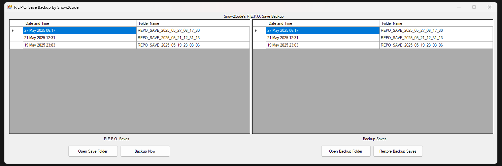

# R.E.P.O. Save Backup

A save backup tool for **REPO** (by semiwork).  
This is an **independent utility** and is **not affiliated** with the REPO developers in any way.

This tool is meant to keep your save files safe (no pun intended).  
**Use this BEFORE starting a level** — because if you (or your entire team) die mid-run, that save is gone unless you made a backup.

---

---

## 🔧 What It Does

Backs up your REPO saves from:

- `C:\Users\<you>\AppData\LocalLow\semiwork\Repo\saves`

To:

- `C:\Users\<you>\Documents\R.E.P.O Saves (Backup)`

---

## Features

- ✅ Backup all save folders with timestamped names like: `REPO_SAVE_2025_05_27_06_17_30`
- ✅ Restore saves from backups (overwrites existing saves, does **not** delete backups)
- ✅ See both current and backed-up saves in a side-by-side UI
- ✅ Open your current save folder or your backup folder from within the app
- ✅ Everything is logged to a `Logs` folder with timestamped log files

---

## UI Breakdown

| Section                | Description                                                  |
|------------------------|--------------------------------------------------------------|
| **R.E.P.O. Saves**     | Left side — shows your active REPO saves                     |
| **Backup Saves**       | Right side — shows all previously created backups            |
| **Open Save Folder**   | Opens the current REPO save folder in File Explorer          |
| **Backup Now**         | Creates a new backup with a timestamp                        |
| **Open Backup Folder** | Opens the backup folder location in File Explorer            |
| **Restore Backup Saves** | Replaces all current REPO saves with the selected backup |

---

## 📝 Logs

A `Logs` folder is created in the launch directory. Each run generates a timestamped log file like: `Logs\28-48-2025 20_48`

### Example log entries:
18:53:01 - R.E.P.O. Save Backup loaded
18:53:10 - Saves backup successful
18:53:22 - Saves backup failed, error message: Access denied
18:53:45 - Load backup saves successful

---

## ⚠️ Important Notes

- This does **not** auto-backup anything. You must click `Backup Now` before a mission or level.
- If your save dies mid-mission, it's gone unless you already made a backup.
- This does **not** remove or delete any backups.
- You can’t back up a death, so make sure you’re not playing like a clown.

---

## 🧰 Requirements

- Windows 10 or newer  
- **Windows only** — this tool is not supported on Linux or macOS and never will be  
- .NET Framework 4.8.1  
- `SnowLib.dll` must be present in the app's folder  

---

## 🛠 Build Info

All the core logic is inside the `SnowLib` DLL (written in .NET Standard 2.0).  
The UI uses WinForms (.NET Framework 4.8.1).

Just build the solution and make sure `SnowLib.dll` is next to the `.exe` when running.

---

## ❄️ Credit

Made by **Snow2Code**  
Use it. Don’t lose your saves to REPO’s death system.  
Because "Game Over" shouldn't mean "save file obliterated".

---
